```{r global_options, include = F}
knitr::opts_chunk$set(eval = F, echo = F, warning = F, message = F)
```

## Table of Contents

1. Professional Profile
2. Cloud Architecture & Infrastructure
3. Genomic Software Development
4. Production Software & APIs
5. People Management
6. Technical Expertise
7. The Random Walk

################################################################################

# Professional Profile {.center}

## What I Bring

> - A diversity of technical and soft skills that can be adapted across a broad range of contexts
> - Fluency operating as both an individual contributor and a people leader
> - A track record of doing the boring stuff well
> - The choice to elevate the people around me as a deliberate practice

## Guiding Principles

**How I approach the work**

> - Every technical decision is also a resource decision — good engineering, science, or leadership are inseparable from good economics
> - Enterprise best practices belong in research environments
> - If we have to get dogmatic about something it should be reproducibility and statistical rigor
> - Solutions sized to actual requirements — pragmatic over fashionable, right-sized instead of over-engineered
> - Straightforward honesty about tradeoffs, timelines, and limitations; trust is built on clarity, not optimism
> - The science is always the point — tools exist to serve outcomes, not demonstrate technical sophistication


## Professional Summary

**Bridging Software Engineering & Genomics**

- **Cloud Architecture:** AWS enterprise infrastructure (EC2, S3, RDS, VPC, IAM, ECR)
- **Genomic Platforms:** Single-cell, spatial transcriptomics, WGS/WES pipelines
- **Software Development:** Python, R, Nextflow, CI/CD, REST APIs
- **Data Scale:** 0.5PB+ genomic datasets, 650+ global collaborators

################################################################################

## Career at a Glance

**2007–2013:** Research Associate

*Wet lab beginnings — foundations of science*

**2016–2017:** Graduate Research Assistant

*NMDP bioinformatics — HLA typing, immunogenomics → computational transition*

**2019–2021:** Graduate Research Assistant

*Cancer genomics — single-cell, beginning of community tool dev*

**2021–2023:** Bioinformatician II

*Total ownership of compute methods — reshaping team science philosophy*

**2021–Present:** Lead Data Engineer

*Intro cloud architecture — complete renovation of 20-year project infra*

**2023–Present:** Senior Manager, Bioinformatics

*Established leadership — 5 reports, consultation across all projects, maturation of strategic planning, design, and solutions — exponential scaling*

################################################################################

## Innovations

**New capabilities, systems, and practices introduced where none previously existed.**

> - **Cloud infrastructure** — first AWS migration for a 20-year consortium project previously running on-prem
> - **Standardized analysis** — unified, containerized framework replacing 12+ ad-hoc team workflows
> - **Distributed compute** — Nextflow-based pipeline execution across HPC and cloud, replacing serial single-machine patterns
> - **Reproducible environments** — renv, Docker, and CI/CD introduced to teams running unversioned local-only stacks
> - **Automated cell annotation** — reference-based and ML-driven labeling (CellTypist, scANVI) replacing manual assignment
> - **GPU-accelerated workflows** — RAPIDS/scVI tooling established for teams running entirely CPU-bound pipelines
> - **Knowledge management** — Confluence/Jira implemented across a consortium running on undocumented institutional memory
> - **FAIR data distribution** — structured, auditable release workflows replacing ad hoc data sharing
> - **On-premises compute** — purpose-built HPC nodes designed and deployed from scratch


## Key Achievements

**Quantifiable Outcomes**

> - **Architected** enterprise AWS infrastructure supporting 0.5PB+ genomic and clinical datasets
> - **Built** $60K+ on-prem compute infrastructure expanding non-technical team compute capacity dramatically
> - **Developed** novel spatial transcriptomics methodologies (Parallax, extension of Sopa, Nova)
> - **Created** standardized single-cell framework (CoreSC) adopted across 12+ projects
> - **Engineered** ID harmonization platform (IDhub) unifying 20 years of longitudinal data
> - **Achieved** zero data loss incidents over 5+ years of data management
> - **Selected** as 10x Genomics beta partner for spatial platform development
> - **Wrote** open-source nf-core institutional execution profile for community
> - **Optimized** costs by replacing $250K+ annual vendor contracts with open-source solutions
> - **Contributed** to $9.5M+ in grants through technical leadership and experimental design

################################################################################

# Cloud Architecture & Infrastructure {.center}

## AWS Enterprise Genomic Platform

**Infrastructure Scale**

- 0.5PB+ genomic data (S3/Glacier)
- EC2 compute clusters with auto-scaling
- VPC networking with WAF security
- Multi-domain hosting (ibdgc.org, ibdgenetics.org)
- **Cost Reduction:** Optimized data life cycle policies, resource alloctions, and spending plans for 50% reduction across cloud budget

**Data Governance**

- HIPAA-compliant PHI isolation
- 3-2-1 backup paradigm
- Zero data loss incidents (5+ years)
- Cross-institutional collaboration frameworks

**Key Components**

- Leverage of low-cost solutions across DNS and web hosting
- Secure VPC with public/private subnets
- S3 buckets with lifecycle policies (Standard → Glacier)
- EC2 Auto Scaling groups for compute workloads
- IAM roles with least-privilege access
- CloudWatch monitoring and alerting

################################################################################

## On-Premises Compute Expansion
**Strategic Infrastructure Investment**

**The Build**

- Sourced, built, and deployed purpose-built **$60K+ on-premises supplementary compute infrastructure**
- Custom node configuration optimized for memory-intensive genomic workloads
- Strategic vendor negotiations to maximize hardware value
- Integrated into cloud-hybrid architecture alongside existing AWS footprint

**Impact**

- **3x expansion** in team computational capacity
- Fraction of cost compared to equivalent commercial cloud alternatives
- Seamless HPC/cloud hybrid workflow execution
- Custom performance tuning for bioinformatics pipelines


## On-Premises Architecture 

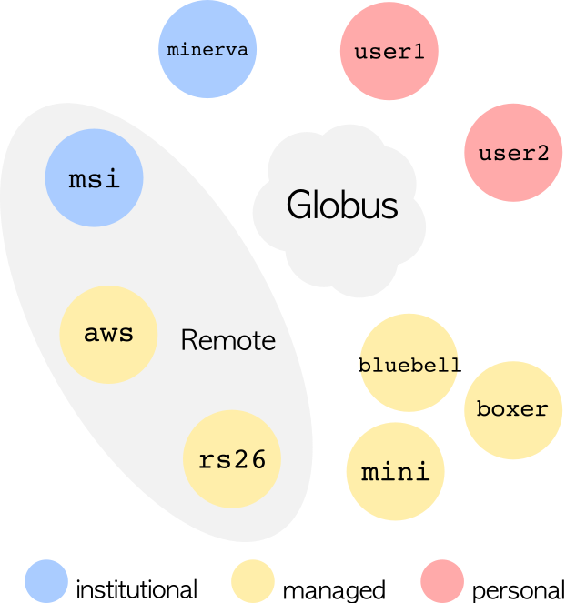

**Technical Specifications**

- Custom node builds for high-memory, flexible, multimodal genomic workloads
- High-speed NFS storage fabric with redundant paths
- Network-attached storage integrated with S3 sync
- High throughput cross node workflow and data transfer via globus

## On-Premises Architecture 

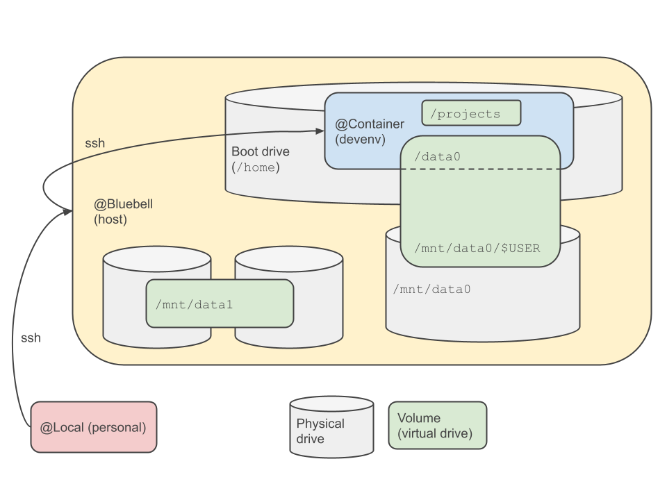

- User-specific, recomposable, containerized dev environments
- Specialized management of complicated R dependencies
- Accessible docs and implementation for Biologists

## On-Premises Architecture 

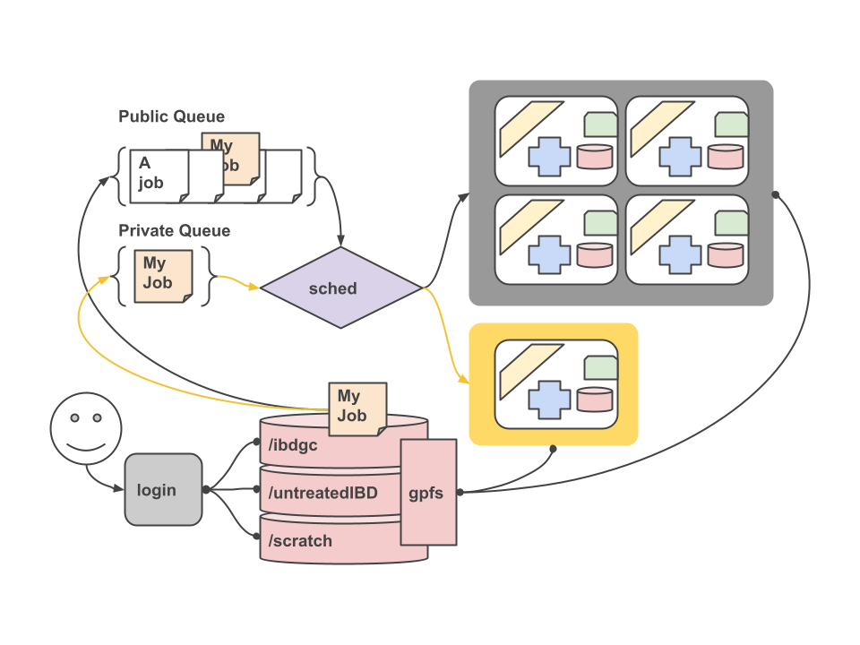

- One node integrated directly with HPC network and GPFS
- Priority queue to our users and collaborators

################################################################################

# Genomic Processing Development{.center}

## CoreSC: Standardized Single-Cell Framework
**Bioinformatics Innovation Lead**

**The Challenge**

- Ad-hoc analysis methods across 12+ projects
- Inconsistent statistical methodologies
- Fragmented reproducibility across international consortia

**The Solution**

- Unified preprocessing paradigm (R/Seurat)
- Containerized deployment (Docker/Kubernetes)
- renv lockfiles for reproducible environments
- Adopted across all internal projects
- **Result:** Eliminated analysis inconsistencies, accelerated discovery for non-technical biologists

################################################################################

## CoreSC Framework Architecture


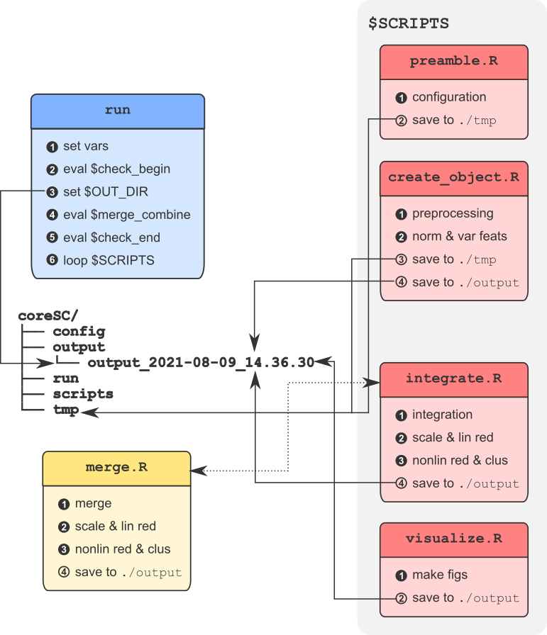

**Technical Implementation**

- R/Seurat for single-cell analysis with SCTransform v2
- renv for reproducible package environments
- Docker containers for portable deployment
- Automated reporting and QC gates

## CoreSC Framework Architecture

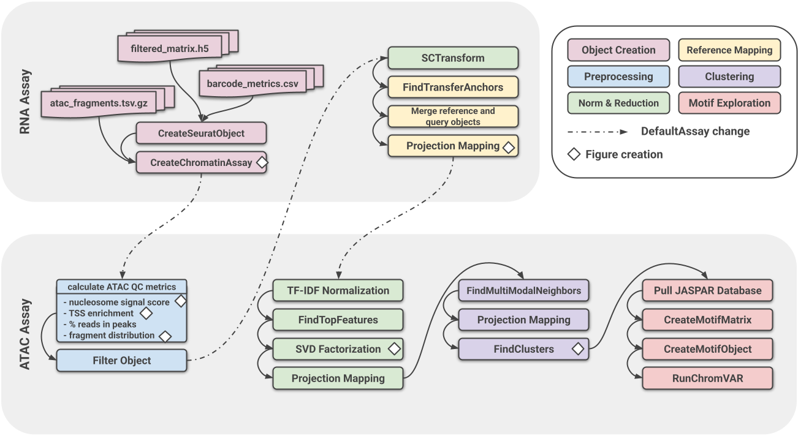

**Technical Implementation**

- Expanded to handle multi-omic single cell data across ATAC and CITE-seq
- Flexible subroutine execution
- Improved capacity for parallelization

################################################################################

## Spatial Transcriptomics Pipelines
**Novel Methodology Development | 10x Genomics Beta Partner**

**Innovation**

- Extended Sopa framework for comprehensive Xenium processing and integration of domain-based processing and scalable execution
- Context-aware spatial differential expression analysis through self-built Parallax pipeline
- Annotation noise correction algorithms for Visium/Xenium
- Multi-sample integration workflows via Novae

**Industry Partnership**

- **10x Genomics Beta Partner** – Cloud hosting feature development for Xenium Explorer
- Direct product roadmap influence and feedback integration on Explorer cloud integration
- Institution-first Xenium deployment (advised on custom power, security, networking implementation)
- Spatial transcriptomics best practices development


## Spatial Analysis Pipelines - Sopa

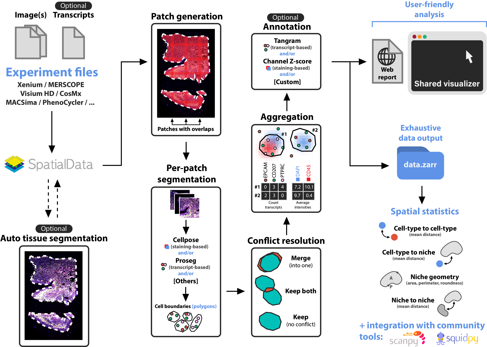

- Contributed LSF compatible implementation
- Extended to include spatial domain assignment workflow
- Wrote extensive run prep workflow to deal with high volume independent sample execution

## Spatial Analysis Pipelines - Parallax

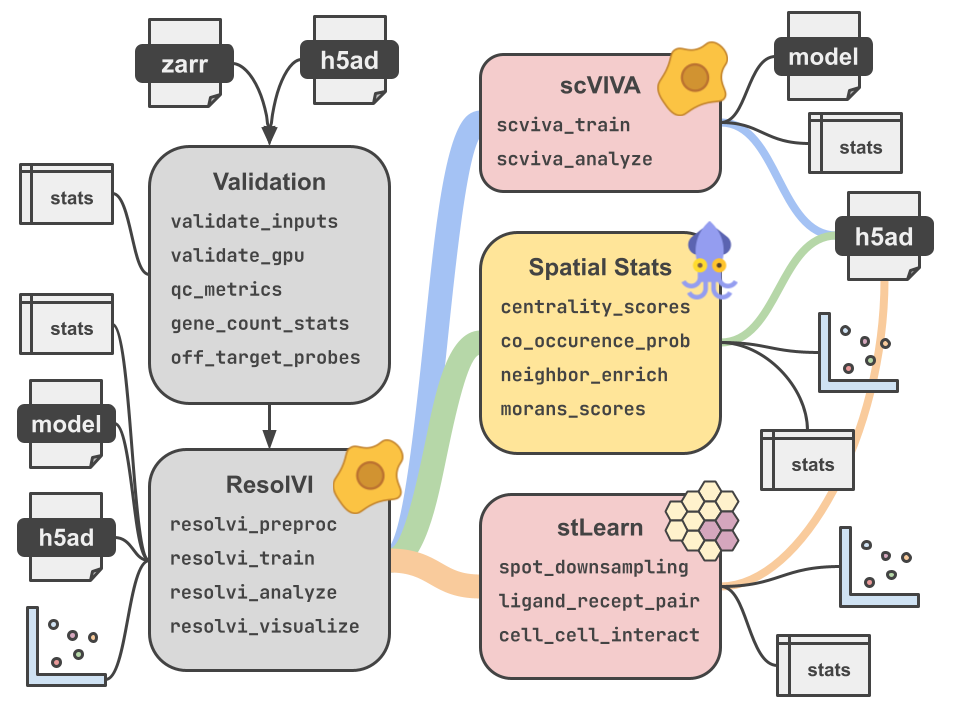

**Technical Implementation**

- In-house nextflow pipeline built on Nextflow DLS2
- Pushes spatial preprocessing further down stream into analysis
- Leveraging bleeding edge variational inference methods from scVI
- Capable of training in distributed GPU array

## Spatial Analysis Pipelines - Parallax

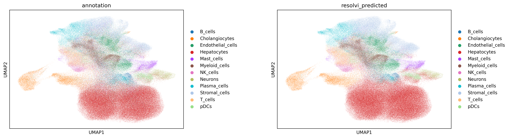

## Spatial Analysis Pipelines - Parallax

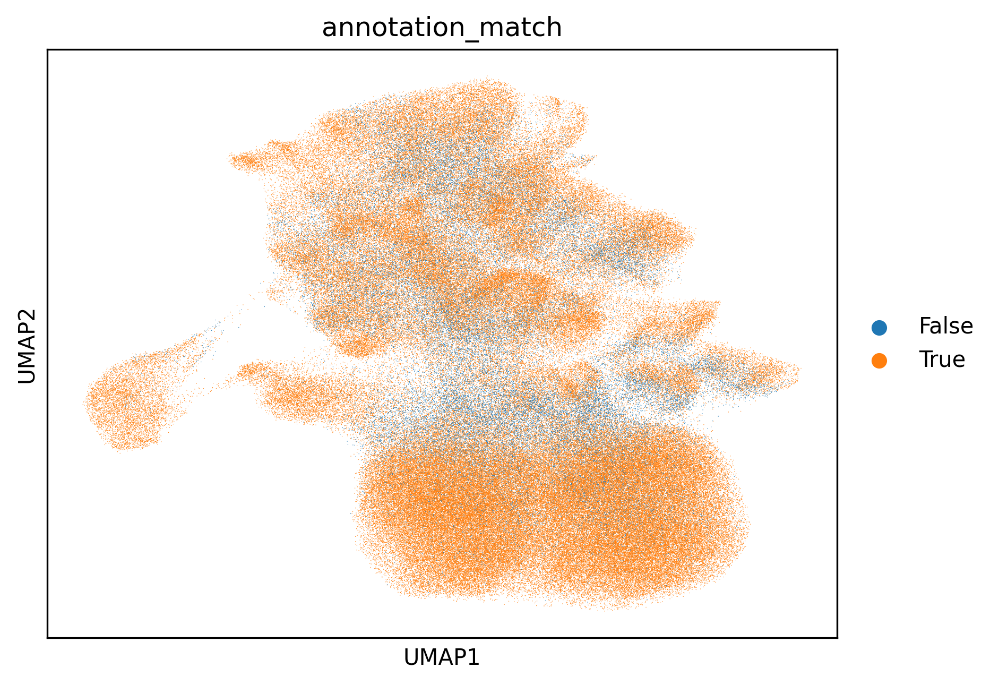


## nf-core & Open Source Contribution
**Institutional Standards Development**

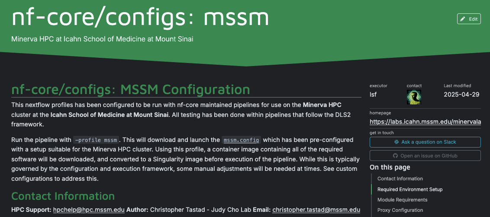

**Community Impact**

- Developed **official Mount Sinai execution profile** for nf-core pipelines
- Standardized HPC configuration (LSF integration)
- CI/CD deployment via GitHub Actions with automated testing

```{bash echo = T}
/*
~~~~~~~~~~~~~~~~~~~~~~~~~~~~~~~~~~~~~~~~~~~~~~~~~~~~~~~~~~~~~~~~~~~~~~~~~~~~~~~~~~~~~
    Nextflow config for Minerva HPC at Icahn School of Medicine at Mount Sinai
~~~~~~~~~~~~~~~~~~~~~~~~~~~~~~~~~~~~~~~~~~~~~~~~~~~~~~~~~~~~~~~~~~~~~~~~~~~~~~~~~~~~~
    Author: Christopher Tastad - Judy Cho Lab
    Contact: christopher.tastad@mssm.edu
    HPC Support: hpchelp@hpc.mssm.edu

    IMPORTANT: Before running this pipeline, set the MINERVA_ALLOCATION environment
    variable in your master submission script:

    export MINERVA_ALLOCATION="acc_YOUR-PROJECT-NAME"

~~~~~~~~~~~~~~~~~~~~~~~~~~~~~~~~~~~~~~~~~~~~~~~~~~~~~~~~~~~~~~~~~~~~~~~~~~~~~~~~~~~~
*/

// Global default params
params {
    config_profile_description = 'Minerva HPC at Icahn School of Medicine at Mount Sinai'
    config_profile_contact     = 'Christopher Tastad (@ctastad)'
    config_profile_url         = 'https://labs.icahn.mssm.edu/minervalab/'

    // Cluster-specific parameters
    minerva_allocation         = System.getenv('MINERVA_ALLOCATION') ?: 'default_allocation'
    max_cpus = 64
    max_memory = '1.5.TB'
    max_time = '336.h'
}


// Singularity configuration
env {
    SINGULARITY_CACHEDIR = "/sc/arion/work/${System.getenv('USER')}/singularity_cache"
    SINGULARITY_TMPDIR = "/sc/arion/work/${System.getenv('USER')}/singularity_tmp"
    SINGULARITY_LOCALCACHEDIR = "/sc/arion/work/${System.getenv('USER')}/singularity_cache"
    SINGULARITY_PULLFOLDER = "/sc/arion/work/${System.getenv('USER')}/singularity_cache/pull"
    SINGULARITY_DISABLE_CACHE = "no"

}

singularity {
    enabled = true
    autoMounts = true
    cacheDir = "/sc/arion/work/${System.getenv('USER')}/singularity_cache"
    pullTimeout = '120 min'

    // Pass proxy settings to container
    envWhitelist = ['http_proxy', 'https_proxy', 'all_proxy', 'no_proxy']
}


// LSF executor configuration
executor {
    name = 'lsf'
    submitRateLimit = '2 sec'
    // Specific LSF settings for proper memory handling
    perJobMemLimit = false
    perTaskReserve = true
    max_time = '336.h'
}

// Process configuration
process {
    executor = 'lsf'
    resourceLimits = [
        cpus: 64,
        memory: 1.5.TB,
        time: 336.h
    ]

    // Dynamic queue selection based on job requirements
    queue = {
        if (task.time > 144.h) {
            return 'long'
        } else if (task.label && task.label.toString().contains('gpu') && task.time <= 30.min) {
            return 'gpuexpress'
        } else if (task.label && task.label.toString().contains('gpu')) {
            return 'gpu'
        } else if (task.time <= 12.h && task.cpus <= 8) {
            return 'express'
        } else {
            return 'premium'
        }
    }

    // Cluster options with proper memory handling
    clusterOptions = {
        def options = "-P ${System.getenv('MINERVA_ALLOCATION') ?: params.minerva_allocation}"

        // Handle memory requests - ensure consistency between -M and rusage
        if (task.memory) {
            def mem = task.memory.toMega()
            options += " -M ${mem}"
        }

        // Add GPU-specific options
        if (task.label && task.label.toString().contains('gpu')) {
            def gpuNum = task.label.toString().contains('high_gpu') ? 2 : 1
            options += " -gpu num=${gpuNum}"
        }

        return options
    }

    // Add gpu awareness to container
    withLabel: 'gpu|.*gpu.*' {
        containerOptions = '--nv'
    }

    // ERROR HANDLING CONFIGURATION
    // Default dynamic error strategy for most processes
    errorStrategy = {
        if (task.exitStatus in [130, 137, 140] && task.attempt <= 3)
            return 'retry'
        else if (task.exitStatus in [131..145] && task.attempt <= 1)
            return 'retry'
        else
            return 'finish'
    }
    maxRetries = 3

    // Special error handling labels (these override the dynamic strategy above)
    withLabel:error_ignore {
        errorStrategy = 'ignore'
        maxRetries = 0
    }

    withLabel:error_retry {
        errorStrategy = 'retry'
        maxRetries = 2
    }

    // Set default failOnMissingField behavior (optional)
    shell = ['/bin/bash', '-euo', 'pipefail']
}

```


# Production Services & Interfaces {.center}

## IDhub: ID Harmonization Platform

**System Architecture**

- PostgreSQL database with REST API
- Global Subject ID resolution service
- Multi-staged curation workflows
- Audit logging & lineage tracking
- Included MCP server interface for planned expansion to sample - data LLM integration
- User friendly web GUI for interactive queries

**Impact Metrics**

- Unified 20 years of consortium recruitment data
- Central source of truth for longitudinal studies
- Automated metadata management (LabKey LIMS API)
- **FAIR-compliant** data distribution via Open Science Framework

################################################################################

## IDhub Workflow Diagram

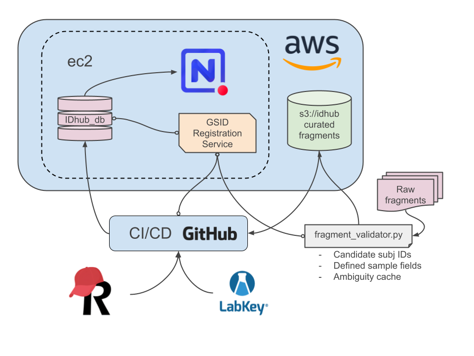

**Process Flow**

1. Multi-source data ingestion (LabKey, REDCap, legacy systems)
2. Staged curation with validation gates
3. REST API serving harmonized IDs
4. Open Science Framework integration for public datasets
5. Cross-referenced global subject resolution

################################################################################

## Bystro: Genomic Annotation Platform
**High-Performance Annotation on the Web**

**Performance Transformation**

- Chosen as beta partner by Bystro AI for self hosted deployment
- **Challenge:** WES/WGS annotation required days of processing with limited accessibility
- **Solution:** Deployed ultra-fast, web-based annotation service in AWS
- **Impact:** Reduced processing time from **days → hours**
- RESTful API architecture enabling widely accessible genomic insights
- Redis caching layer for frequent queries

**Technical Stack**

- AWS EC2 compute tier for variant annotation engines
- Redis caching for frequent gene/variant queries
- PostgreSQL for genomic coordinates and annotations
- React frontend for interactive visualization
- REST API for programmatic access

################################################################################

## REDCap-Booster & Data Automation
**Metadata Management Systems**

**Automation Stack**

- Python/R automation utilities for ETL processes
- LabKey sample management API integration
- REDCap API for clinical data capture
- Sanitization and curation frameworks for clinical metadata harmonization

**Operational Impact**

- Reduced manual curation overhead by 80%
- Systematic data stewardship protocols
- Cloud-hosted automated subject identification
- 20-year longitudinal study support with maximized data lineage

################################################################################

## Data Automation Pipeline

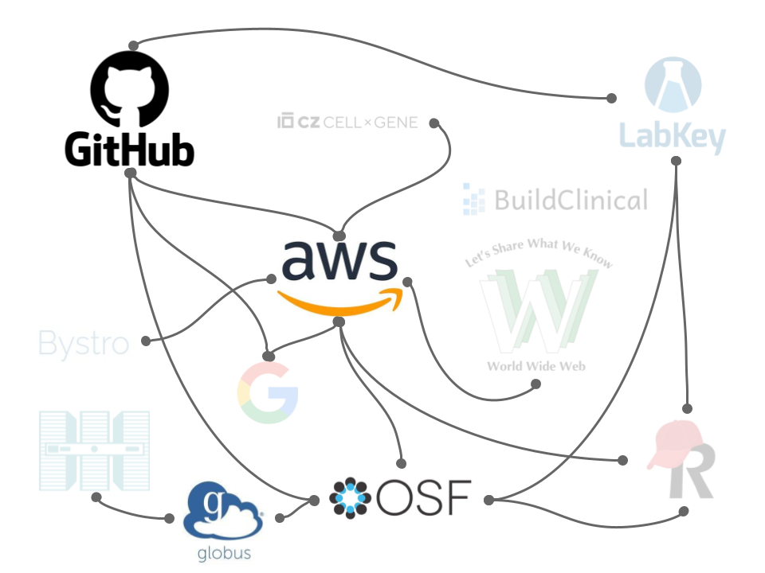

**Integration Points**

- REDCap API for clinical data capture
- LabKey API for biospecimen tracking
- Automated quality checks and validation rules
- Cloud storage synchronization with S3
- Audit logging for compliance tracking

################################################################################

# People Management {.center}

## Team Leadership

**Management Scope**

- Lead 5-person bioinformatics team across 12+ concurrent multi-year projects
- Lead 4-person analyst team for Data Coordinating Center of NIDDK IBD Genetics Consortium across infrastructure and data archival responsibilities
- Flexible **Agile methodologies:** Daily stand-ups, weekly office hours, data round tables
- Recruitment, screening, and knowledge transfer protocols
- Quarterly workload assessments & roadmap planning with principal investigators

################################################################################


## Knowledge Management & Institutional Memory
**Organizational Systems Development**

**Implementation**

- Established organizational knowledge management implementing **Atlassian services (Confluence/Jira)** across team and consortium
- Deployed and managed Google Workspace services for inter-institutional communication and organization
- Rigorous information organization standards and documentation taxonomy
- Onboarding systems reducing new contributor ramp-up time
- Enforcement of wide-spread use of code and data version control systems

**Impact**

- Consistent project tracking across 12+ simultaneous initiatives
- Consortium-wide visibility into project status and deliverables
- Searchable institutional knowledge base (SOPs, protocols, decisions)
- Reduced knowledge silos and single-point-of-failure personnel risk

################################################################################

## AI-Assisted Development Infrastructure
**Enterprise Innovation | Tech Lead**

**Implementation**

- Deployed **Sourcegraph** enterprise platform for secure team LLM access
- Pioneered AI-assisted development tools in bioinformatics workflows
- Established institutional standards for responsible AI adoption
- Tech lead on methodological innovation (dozen+ major initiatives)

**Impact**

- Accelerated code review and documentation processes
- Standardized prompt engineering for genomic analysis
- Secure, HIPAA-compliant AI tool deployment
- Measurable team productivity improvement

################################################################################

# The Random Walk {.center}

## Experience That Defies Categorization

**The Roles**

- **Lobbyist** – Stakeholder communication, coalition building, legislative process navigation
- **UPS Operations** – Logistics systems, high-pressure throughput, operational accountability
- **Manual & Farm Labor** – Physical discipline, grunt work, real-time execution

**Transferable Skills**

- Communication that works across every audience
- The ability to do hard, unglamorous things without complaint
- Respect for operational complexity at every level of an organization
- Translating technical work for non-technical decision makers
- Comfort with ambiguity, durability under pressure, execution focus
- Empathy for people below my station
- The diplomacy to navigate challenging work environments

################################################################################

# Contact

- **Email:** [ctastad@gmail.com](mailto:ctastad@gmail.com)
- **LinkedIn:** [linkedin.com/in/ctastad](https://linkedin.com/in/ctastad)
- **GitHub:** [github.com/ctastad](https://github.com/ctastad)
- **Phone:** (612) 817-7989
- **Location:** HQ in NYC | Based out of MPLS, MN

**Download Full CV:** [https://github.com/ctastad/cv](https://github.com/ctastad/cv)

################################################################################

<!-- style -->

<style>

/* ── Background fix: overrides revealjs night theme at every level ── */
:root {
  --r-background-color: #2e3440;
}

.reveal-viewport {
  background: #2e3440;
  background-color: #2e3440;
}

.reveal,
.reveal .slides,
.backgrounds {
  background: #2e3440 !important;
  background-color: #2e3440 !important;
}

/* ── Title slide ── */
h1.title {
  color: #a3be8c;
}

h1.subtitle {
  font-size: 42px;
  color: #81a1c1;
}

/* ── Code blocks ── */
div.sourceCode {
  background-color: #2e3440;
}

.sourceCode {
  background-color: #393f4b;
}

/* ── Images ── */
.reveal section img {
  border: 30px solid #e0e1e2;
  border-radius: 10px;
  display: block;
  margin-left: auto;
  margin-right: auto;
  max-width: 85%;
}

/* ── Text alignment ── */
.reveal p {
  text-align: left;
}

/* ── Lists ── */
.reveal ul {
  display: block;
  margin-left: 1.5em;
}

.reveal ol {
  display: block;
  margin-left: 1.5em;
}

/* ── Headings ── */
.reveal h2 {
  color: #a3be8c;
  margin-bottom: 0.5em;
}

.reveal h3 {
  color: #81a1c1;
  margin-top: 0.8em;
}

/* ── Inline emphasis ── */
.reveal strong {
  color: #a3be8c;
}

/* ── Blockquotes ── */
.reveal blockquote {
  background: #3b4252;
  border-left: 5px solid #a3be8c;
  padding: 0.5em 1em;
  font-style: italic;
}

</style>

